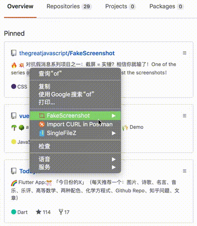
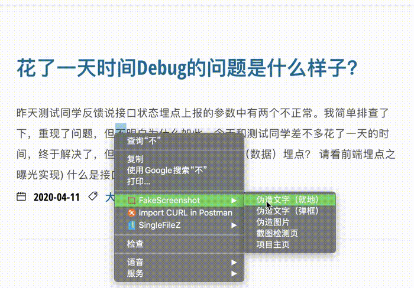
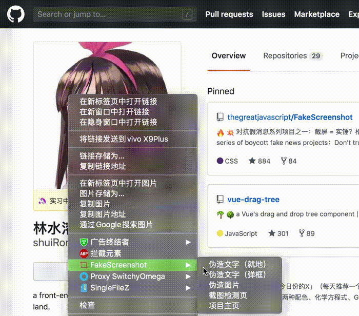
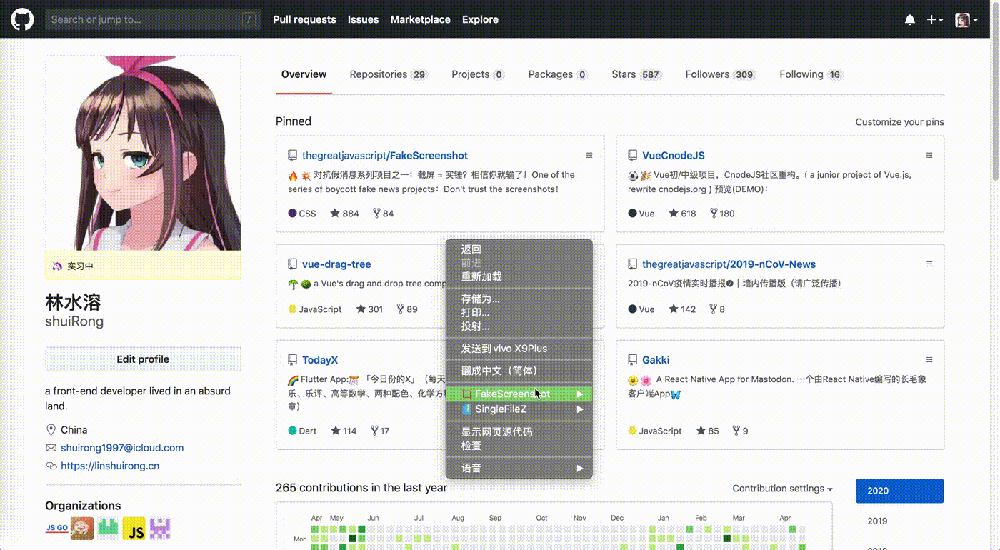
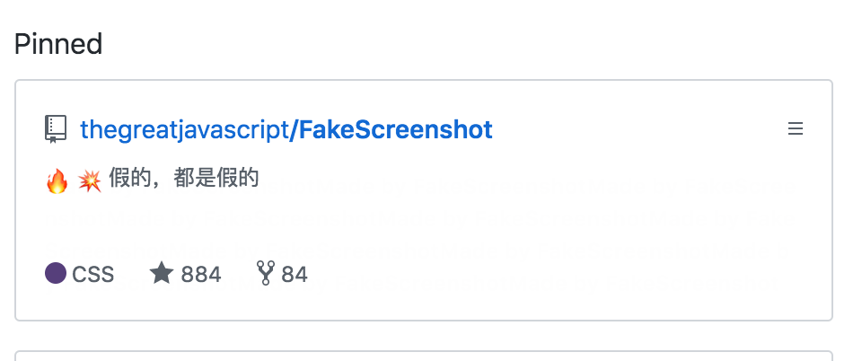
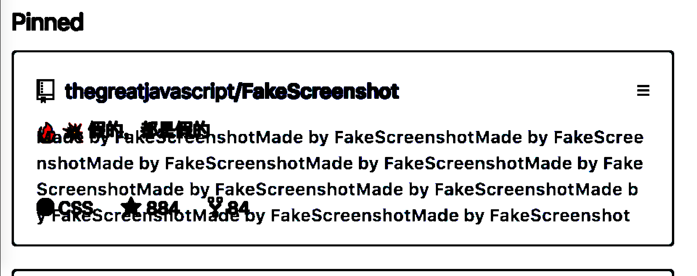

# FakeScreenshot2.0/虚假截图助手2.0
> 这是一个可以**伪造任何网站界面截图**的工具。
>
> 但本工具的目的其实不是破坏，而是为了警告（不懂编程的）普通人：**不要轻易相信网上看到的“截图”！**

**2020-4-26：突破性更新**，可以修改任何网站的任何文字/图片。 

### 功能预览

---

|      |      |
| ---- | ---- |
|      |      |

### 如何使用？

---

下载正式版：

1. 准备好Chrome浏览器和**翻墙**工具。
2. 从Chrome扩展商店[安装](https://chrome.google.com/webstore/detail/fakescreenshot/jiojdapfbpmhpihdejiglphhoeakjhmi)即可。

下载开发者版（方便不能翻墙的人使用）：

1. 下载Chrome浏览器（版本越高越好）
2. 从[本仓库中](https://raw.githubusercontent.com/thegreatjavascript/FakeScreenshot/master/dist-zip/fakescreenshot-v1.0.0.zip)下载开发版，然后解压缩。
3. 在浏览器打开`chrome://extension`页面，并且打开右上角的“开发者模式”
4. 点击左上角“加载已解压的扩展程序”并选择解压好的文件夹

#### 项目灵感

---

如果有一天你在群里看到这么一张图，你第一反应是什么？

“卧槽，这么快？”

“正好这段时间没事做，学一下”

“和2.0有什么区别啊？”

“求你们别更了，我学不动了.jpg ？”

"支持TS吗？"

**不管怎样，只要第一反应不是怀疑其真实性，那么你就很可能成为“假截图”的受害者！**

我们都曾看到过各种截屏：包括不限于`知乎`、`微博`、`豆瓣`、`NGA`、`V2EX`、`QQ`、`微信` 、`各种新闻站`...

如果那些截屏内容只涉及到段子还好，但多数情况不是。它们往往和某事/某人有关，这（假截图）就**极有可能**导致人们对该事/人产生错误的看法（之所以说错误，是因为我认为**大多数**假截图的制作者都怀有不良动机。）

另外，**多数人并不会去主动验证该截图描述事情的真伪**（不这么做的原因这里不做讨论），这是“假截图”泛滥的重要原因之一。

### 对此我能做什么呢？

---

**三个方向：**

1. 阻止传播（极难实现）
2. 告诉人们应该主动去求证（很难实现）
3. 告诉人们应该怀疑一切截图的真实性（比较容易）

我选择了第三个方向。

而在方法的选择上，我选择反其道而行之：开发一个可以非常简单地修改**任何网站文字/图片**的工具。（当然，只支持PC版）

**我通过该工具本身来告诉人们这样一件事：“啊，原来任何网页的截图都可能是假的！”**

### 水印

---

本工具的目的是传递（如上的）信息，而不是破坏。因此所有经过本工具制作出来的截图都被打上了**水印**。

水印的处理分为两种：

1. 修改网页文字时会打上透明水印。（肉眼不可见，但经过专门提供的[水印检查]()工具可以检查出来）
2. 修改图片时会打上肉眼可见（但比较浅）的水印。

